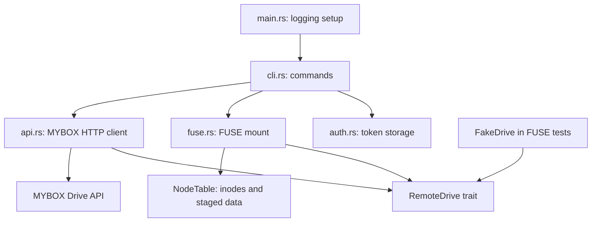

# Architecture

`myboxfs` is a Rust command-line application that presents NAVER MYBOX as a
Linux userspace filesystem. The FUSE layer translates kernel filesystem
requests into operations on the MYBOX Drive API.

## Component Map

## Modules

| Module         | Responsibility                                                                                                                          |
| -------------- | --------------------------------------------------------------------------------------------------------------------------------------- |
| `src/main.rs`  | Initializes tracing using `RUST_LOG` when set, then starts the CLI.                                                                     |
| `src/cli.rs`   | Implements `login`, `health-check`, `mount`, and `unmount`.                                                                             |
| `src/auth.rs`  | Reads and writes the personal access token under the XDG config directory (or `~/.config`); on Unix, saved token files are mode `0600`. |
| `src/api.rs`   | Defines `RemoteEntry` and the `RemoteDrive` interface, and implements MYBOX HTTP requests using a blocking `reqwest` client.            |
| `src/fuse.rs`  | Implements FUSE callbacks, maps remote items to in-memory inodes, stages file edits, and starts or stops the mount.                     |
| `src/cache.rs` | Contains an empty `MetadataCache` placeholder; it is not currently used by the filesystem.                                              |
| `src/lib.rs`   | Exposes the modules and the shared boxed-error `Result` type.                                                                           |

## Filesystem State

`MyboxFs<D>` depends on `RemoteDrive`, so the same filesystem logic can use
the production `MyboxApiClient` or a fake drive in tests. A mutex-protected
`NodeTable` holds the synthetic inode-to-entry mapping, parent/child inode
lists, directories loaded during this mount, and dirty file contents. Inode
1 represents the root; other inodes are assigned as directories are loaded
or items are created.

Directory contents are fetched on first access and then served from the
in-memory table for the rest of the mount. Successful local mutations update
that table. There is no active metadata cache, TTL-based refresh, or
cross-process change detection. FUSE attributes use a one-second kernel
attribute TTL; timestamps are currently reported as the Unix epoch.

## Request Flow

1. `main` configures tracing and calls `cli::run`.
2. The CLI loads the token for `health-check` and `mount`; `login` prompts
   without echo, validates the token against the storage endpoint, then saves
   it.
3. `fuse::mount` creates `MyboxFs<MyboxApiClient>` and enters the FUSE event
   loop.
4. FUSE callbacks consult or update `NodeTable`, then call `RemoteDrive` for
   remote reads and mutations.
5. `MyboxApiClient` sends authenticated API requests. File uploads use a
   separate upload URL returned by MYBOX; file downloads use a separate
   download URL.

`MyboxApiClient::list_resources` follows API cursors to collect all pages.
Tests can implement `RemoteDrive` without MYBOX credentials. The current
tests focus on filesystem behavior; the production HTTP client is not
replaced by a mock HTTP server in this codebase.
