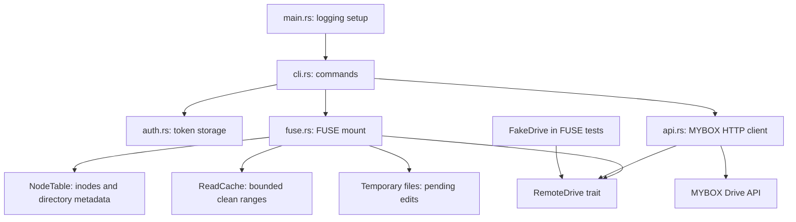

# Architecture

`myboxfs` is a Rust command-line application that presents NAVER MYBOX as a
Linux userspace filesystem. The FUSE layer translates kernel filesystem
requests into operations on the MYBOX Drive API.

## Component Map

## Modules

| Module                     | Responsibility                                                                                                                          |
| -------------------------- | --------------------------------------------------------------------------------------------------------------------------------------- |
| `src/main.rs`              | Initializes tracing using `RUST_LOG` when set, then starts the CLI.                                                                     |
| `src/cli.rs`               | Implements `login`, `health-check`, `mount`, and `unmount`.                                                                             |
| `src/bin/mount-myboxfs.rs` | Entry point for the helper installed as `mount.myboxfs`.                                                                                |
| `src/mount_helper.rs`      | Parses mount-helper arguments and FUSE options, selects the local user, drops privileges, and reports background startup status.        |
| `src/auth.rs`              | Reads and writes the personal access token under the XDG config directory (or `~/.config`); on Unix, saved token files are mode `0600`. |
| `src/api.rs`               | Defines `RemoteEntry` and the `RemoteDrive` interface, and implements MYBOX HTTP requests using a blocking `reqwest` client.            |
| `src/fuse.rs`              | Implements FUSE callbacks, maps remote items to in-memory inodes, stages file edits, and starts or stops the mount.                     |
| `src/cache.rs`             | Implements a 4 MiB, two-second cache for clean file read ranges.                                                                        |
| `src/lib.rs`               | Exposes the modules and the shared boxed-error `Result` type.                                                                           |

## Filesystem State

`MyboxFs<D>` depends on `RemoteDrive`, so the same filesystem logic can use
the production `MyboxApiClient` or a fake drive in tests. A mutex-protected
`NodeTable` holds the synthetic inode-to-entry mapping, parent/child inode
lists, directory listing expiration times, open/lookup references, and temporary
file handles for dirty data. Inode 1 represents the root; other inodes are
assigned as directories are loaded or items are created.

Directory contents are refreshed after five seconds, preserving existing
inodes by resource ID. Successful local mutations update the table immediately.
Clean read ranges are cached for two seconds (4 MiB maximum) and invalidated
on local edits and detected remote metadata changes. FUSE attributes have a
one-second kernel TTL and use remote RFC3339 modification times when present;
the Unix epoch is used when they are unavailable. External edits can remain
stale until the listing refreshes, and retained directory metadata is not yet
bounded in memory.

## Request Flow

1. `main` configures tracing and calls `cli::run`.
2. The CLI loads the token for `health-check` and `mount`; `login` prompts
   without echo, validates the token against the storage endpoint, then saves
   it.
3. `fuse::mount` creates `MyboxFs<MyboxApiClient>` and enters the FUSE event
   loop.
4. FUSE callbacks consult or update `NodeTable`, then call `RemoteDrive` for
   remote reads and mutations.
5. `MyboxApiClient` sends authenticated API requests. File uploads use a
   separate HTTPS upload URL returned by MYBOX; file downloads use a separate
   HTTPS download URL. The HTTP client verifies certificates, bounds request
   times, and retries only safe read requests on transient failures.

`MyboxApiClient::list_resources` follows API cursors to collect all pages.
Tests can implement `RemoteDrive` without MYBOX credentials. Filesystem tests
use a fake drive; a local HTTP test covers a transient read retry, but the
full MYBOX API contract has not been exercised against a mock HTTP server.

## Mount Helper

For fstab mounts, `mount.myboxfs` uses the source field as a local username.
The helper resolves the user's UID, GID, and home directory through the system
account database, then switches to that identity before loading the token and
constructing the filesystem. `MyboxFs` uses the process UID/GID for ownership.
Token lookup uses the selected user's home rather than inherited root config
paths; an absolute `token_file` option can override the location.

Background mounts re-execute the helper as a detached child. The child creates
a FUSE session and reports readiness or a startup error through a pipe before
redirecting standard streams to `/dev/null` and running the session. The parent
returns success only after receiving readiness. Foreground mounts run the
session directly. Option parsing preserves default permissions, disables
set-user-ID and device handling, and maps access options to FUSE's session ACL.
